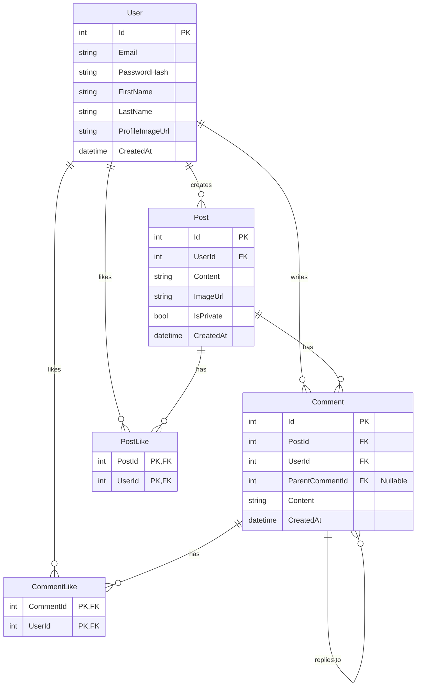

# Social Feed Application

A full-stack social media application featuring a responsive feed, user authentication, and multimedia post capabilities. Built with a modern .NET 9 API and a React 19 frontend.

## 🚀 Features

- **User Authentication**: Secure Registration and Login flows using JWT.
- **Social Feed**: View posts from other users in a dynamic feed.
- **Post Creation**: optimized interface for creating new posts.
- **Media Support**: Integration with Google Cloud Storage for handling all media uploads.
- **Responsive Design**: Mobile-friendly interface ensuring a seamless experience across devices.

## 🛠️ Tech Stack

### Backend
- **Framework**: [.NET 9](https://dotnet.microsoft.com/) (ASP.NET Core Web API)
- **Database**: PostgreSQL (Entity Framework Core)
- **Authentication**: JWT Bearer
- **Documentation**: Swagger / OpenAPI

### Frontend
- **Framework**: [React 19](https://react.dev/)
- **Build Tool**: [Vite](https://vitejs.dev/)
- **Language**: TypeScript
- **State/Routing**: React Router v7

### Infrastructure
- **Containerization**: Docker & Docker Compose
- **Hosting Reference**: Deployed on Google Cloud (Backend) and Firebase (Frontend)

## 📋 Prerequisites

Ensure you have the following installed locally:
- [Node.js](https://nodejs.org/) (v18+)
- [.NET 9 SDK](https://dotnet.microsoft.com/download/dotnet/9.0)
- [Docker & Docker Compose](https://www.docker.com/) (optional, generic PostgreSQL installed locally is also fine)

## ⚡ Getting Started

### 1. Database Setup

You can spin up a PostgreSQL instance quickly using Docker:

```bash
docker-compose up -d
```
This will start a PostgreSQL container with the credentials defined in `docker-compose.yml`.

### 2. Backend Setup (`SocialFeed.API`)

Navigate to the API directory and start the server:

```bash
cd SocialFeed.API
dotnet restore
dotnet run
```

The API will be available at `http://localhost:5112` (or similar port printed in console).
Swagger documentation is available at `/swagger`.

**Note:** The application is configured to automatically apply migrations and seed data on startup.

### 3. Frontend Setup (`SocialFeed`)

Open a new terminal, navigate to the frontend directory, install dependencies, and run the development server:

```bash
cd SocialFeed
npm install
npm run dev
```

The application will be available at `http://localhost:5173`.

## 🔧 Configuration

### Backend (`appsettings.json` / Environment Variables)
- `ConnectionStrings:DefaultConnection`: PostgreSQL connection string.
- `JwtSettings:Key`: Secret key for token generation.
- `GcpStorage`: Configuration for Google Cloud Storage (Bucket Name, Credentials, etc.).

### Frontend
- Environment variables are managed via `.env` files (e.g., API base URL).

## � Entity Relationship Diagram



## �📄 License
This project is available for use and modification.
